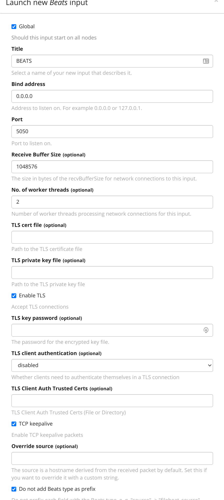

# Simple one node Graylog setup with Traefik, Cloudflare/Let's Encrypt, Filebeat  GELF/SYSLOG/BEATS support, and GeoIP updates

[](https://www.buymeacoffee.com/marcinbojko)

Consider buying me a coffee if you like my work. All donations are appreciated. All donations will be used to pay for pipeline running costs

## What for

- Tests
- More Tests
- Graylog Enterprise non-prod (Graylog license below 2 GB Day is free)
- Restore of archives created with Graylog Enterprise (long term storage)
- Back/front separation with Traefik as loadbalancer/proxy
- can be easy reworked into multiple node setup
- Filebeat example can be easily replicated to smaller non-prod setups

## Network diagram


## Credentials to set

### Docker/Docker Compose

#### `.env`

```ini
ELASTIC_VERSION=7.17.4
ES_JAVA_OPTS=-Xms1g -Xmx1g -Dlog4j2.formatMsgNoLookups=true
FILEBEAT_TAG=7.17.4
GRAYLOG_HOSTNAME=graylog.somedomain.com
GRAYLOG_URL=http://127.0.0.1:9000/
GRAYLOG_VERSION=4.3.0-1-jre11
GRAYLOG_PLUGINS=4.3.0
MONGO_VERSION=3
OFELIA_TAG=v0.3.6
TRAEFIK_TAG=2.7.0
TRAEFIK_HOSTNAME=traefik.somedomain.com
TZ=Europe/Warsaw
```

### Traefik dashboard

Dashboard is available at localhost or [https://$TRAEFIK_HOSTNAME](https://$TRAEFIK_HOSTNAME) (.env)
Default credentials for Traefik dashboards are: `admin:password`

### Cloudflare/Let's Encrypt

Support for Cloudflare DNS challenge will allow to host this setup internaly with no self-sign certs

#### `/traefik/etc/cloudflare.env`

```ini
CF_API_EMAIL=someemail@somedomein.com
CF_DNS_API_TOKEN=sometoken
```

### GeoIP

Sign in for free MaxMind GeoLite2 database access here [https://www.maxmind.com/en/geolite2/signup](https://www.maxmind.com/en/geolite2/signup)

#### `/geoip/geoip.env`

Fill in `GEOIPUPDATE_ACCOUNT_ID` and `GEOIPUPDATE_LICENSE_KEY`

```ini
GEOIPUPDATE_ACCOUNT_ID=1111111
GEOIPUPDATE_LICENSE_KEY=bbbbbbbbbbbbbbb
GEOIPUPDATE_EDITION_IDS=GeoLite2-City
GEOIPUPDATE_FREQUENCY=24
```

### Graylog

Graylog dashboard is available at [https://GRAYLOG_HOSTNAME]

For sending notifications fill in variables in `graylog/graylog.env`

```ini
GRAYLOG_TRANSPORT_EMAIL_ENABLED=true
GRAYLOG_TRANSPORT_EMAIL_HOSTNAME=somedomain.com
GRAYLOG_TRANSPORT_EMAIL_PORT=587
GRAYLOG_TRANSPORT_EMAIL_USE_AUTH=true
GRAYLOG_TRANSPORT_EMAIL_USE_TLS=true
GRAYLOG_TRANSPORT_EMAIL_USE_SSL=false
GRAYLOG_TRANSPORT_EMAIL_AUTH_USERNAME=graylog@somedomain.com
GRAYLOG_TRANSPORT_EMAIL_AUTH_PASSWORD=sometoken
GRAYLOG_TRANSPORT_EMAIL_FROM_EMAIL=graylog@somedomain.com
GRAYLOG_TRANSPORT_EMAIL_SUBJECT_PREFIX=[graylog]
GRAYLOG_TRANSPORT_EMAIL_WEB_INTERFACE_URL=https://graylog.somedomain.com
```

#### Default graylog dashboard password

username: admin
password: admin

```ini
GRAYLOG_ROOT_PASSWORD_SHA2=8c6976e5b5410415bde908bd4dee15dfb167a9c873fc4bb8a81f6f2ab448a918
```

## Components

### Traefik

Most elements to change are in traefik/etc folder

Opened ports:

|Port|Destination Port|Destination|
|----|----------------|-----------|
|80|80|http|
|443|443|https|
|12201|12201|GELF HTTP|
|12202|12202|GELF TCP/UDP|
|15514|15514|Syslog TCP/UDP|
|5050|5050|Beats|
|----|----------------|-----------|

### Elasticsearch

### MongoDB

### Graylog 4

#### Inputs - Beats(TLS)

To create BEATS input on port 5050 go to `System/Inputs`, pick `Beats` as new input, press `Launch new input` and configure as mentioned on image





To provide your own certificates mount cert and key file into docker graylog volumes

#### Plugins

Everytime you're changing Graylog version (in .env file)  you should also change plugins in /gralog/plugins/ and `docker-compose` graylog section. Use `${GRAYLOG_PLUGINS}` variable to manage plugin versions

```yaml
  graylog:
    image: graylog/graylog:${GRAYLOG_VERSION}
    container_name: graylog
    volumes:
      - graylog_journal:/usr/share/graylog/data/journal
      - graylog_data:/usr/share/graylog/data
      - graylog_archives:/archives
      - graylog_shared:/data/shared
      - graylog_geoip:/etc/graylog/server:ro
      - ./graylog/node-id.gl2:/usr/share/graylog/data/config/node-id
      - ./graylog/plugins/graylog-plugin-enterprise-${GRAYLOG_PLUGINS}.jar:/usr/share/graylog/plugin/graylog-plugin-enterprise-${GRAYLOG_PLUGINS}.jar
      - ./graylog/plugins/graylog-plugin-enterprise-es6-${GRAYLOG_PLUGINS}.jar:/usr/share/graylog/plugin/graylog-plugin-enterprise-es6-${GRAYLOG_PLUGINS}.jar
      - ./graylog/plugins/graylog-plugin-enterprise-es7-${GRAYLOG_PLUGINS}.jar:/usr/share/graylog/plugin/graylog-plugin-enterprise-es7-${GRAYLOG_PLUGINS}.jar
      - ./graylog/plugins/graylog-plugin-enterprise-integrations-${GRAYLOG_PLUGINS}.jar:/usr/share/graylog/plugin/graylog-plugin-enterprise-integrations-${GRAYLOG_PLUGINS}.jar
      - ./graylog/plugins/graylog-plugin-integrations-${GRAYLOG_PLUGINS}.jar:/usr/share/graylog/plugin/graylog-plugin-integrations-${GRAYLOG_PLUGINS}.jar
      - ./graylog/plugins/graylog-plugin-aws-${GRAYLOG_PLUGINS}.jar:/usr/share/graylog/plugin/graylog-plugin-aws-${GRAYLOG_PLUGINS}.jar
      - ./graylog/plugins/graylog-plugin-collector-${GRAYLOG_PLUGINS}.jar:/usr/share/graylog/plugin/graylog-plugin-collector-${GRAYLOG_PLUGINS}.jar
      - ./graylog/plugins/graylog-plugin-threatintel-${GRAYLOG_PLUGINS}.jar:/usr/share/graylog/plugin/graylog-plugin-threatintel-${GRAYLOG_PLUGINS}.jar
      - ./graylog/plugins/graylog-storage-elasticsearch6-${GRAYLOG_PLUGINS}.jar:/usr/share/graylog/plugin/graylog-storage-elasticsearch6-${GRAYLOG_PLUGINS}.jar
      - ./graylog/plugins/graylog-storage-elasticsearch7-${GRAYLOG_PLUGINS}.jar:/usr/share/graylog/plugin/graylog-storage-elasticsearch7-${GRAYLOG_PLUGINS}.jar
      - ./graylog/plugins/metrics-reporter-prometheus-3.0.0.jar:/usr/share/graylog/plugin/metrics-reporter-prometheus-3.0.0.jar
```

### Ofelia

Used for scheduled task (like traefik logrotation)

### Filebeat

Filebeat is configured to deliver traefik logs directly to graylog after creation of BEATS input at port 5050

## To do

- Let's encrypt cert extraction for GELF/BEATS
- GELF HTTP/HTTPS
- Multiple node (HA) setup

## Author

- Marcin Bojko marcin@bojko.com.pl
- www: [bojko.dev](bojko.dev)
